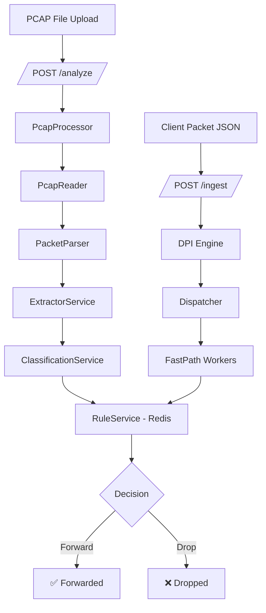

# 🔍 DPI Backend Service — Deep Packet Inspection Engine

A high-performance **Deep Packet Inspection (DPI)** backend built with **FastAPI**, capable of analyzing network traffic from `.pcap` files or live API ingestion. It extracts TLS SNI, classifies applications (YouTube, Facebook, Netflix, etc.), and enforces blocking rules via Redis.

---

## ✨ Features

- 📂 **PCAP File Analysis** — Upload `.pcap` files and get a full DPI report
- 🧠 **TLS SNI Extraction** — Identifies domains from encrypted HTTPS traffic
- 🌐 **HTTP Host / DNS Extraction** — Inspects plaintext HTTP and DNS queries
- 📱 **App Classification** — Detects 17+ apps (YouTube, Instagram, TikTok, Discord, etc.)
- 🚫 **Rule-based Blocking** — Block by IP, domain, app, or port (Redis-backed)
- 📊 **Real-time Statistics** — Track packets, bytes, protocols, and blocked connections
- 🧵 **Async Worker Architecture** — Dispatch + Fast Path workers for parallel processing

---

## 🏗 Architecture



---

## 📂 Project Structure

```
├── main.py                          # App entry point — registers routers
├── requirements.txt                 # Python dependencies
├── test_dpi.pcap                    # Sample PCAP file for testing
│
├── app/
│   ├── routes/                      # API endpoints (separated by feature)
│   │   ├── pcap_routes.py           #   POST /analyze (PCAP file upload)
│   │   ├── ingest_routes.py         #   POST /ingest (live packet API)
│   │   ├── stats_routes.py          #   GET /stats, /health
│   │   └── rules_routes.py          #   CRUD for /rules/ip, /domain, /app
│   │
│   ├── services/                    # Core business logic
│   │   ├── pcap_processor.py        #   Full PCAP → DPI pipeline
│   │   ├── pcap_reader_service.py   #   Reads raw packets from .pcap files
│   │   ├── packet_parser_service.py #   Parses Ethernet/IP/TCP/UDP headers
│   │   ├── extractors_service.py    #   TLS SNI, HTTP Host, DNS extraction
│   │   ├── classification_service.py#   Maps domain → AppType (YouTube, etc.)
│   │   ├── rule_service.py          #   Blocking rules engine (Redis)
│   │   ├── dpi_engine.py            #   Main orchestrator for API ingestion
│   │   ├── dispatcher_service.py    #   Load balances to FastPath workers
│   │   ├── fast_path.py             #   Worker that processes packets
│   │   ├── connection.py            #   Connection/flow tracker
│   │   └── sni_extractor.py         #   Standalone SNI extractor
│   │
│   ├── schema/                      # Pydantic data models
│   │   ├── pcap_report_schema.py    #   PCAP analysis report response
│   │   ├── packet_schema.py         #   Packet input model
│   │   ├── parsed_packet_schema.py  #   Parsed packet fields
│   │   ├── connection_schema.py     #   FiveTuple, AppType, ConnectionState
│   │   ├── rule_schema.py           #   Block reason models
│   │   └── stats_schema.py          #   Stats response model
│   │
│   └── cache/
│       └── redis.py                 # Async Redis client (connection pool)
```

---

## 🚀 Getting Started

### Prerequisites

- **Python 3.10+**
- **Redis** (for blocking rules)

### 1. Clone the Repository

```bash
git clone https://github.com/your-username/deep-packet-inspection.git
cd deep-packet-inspection
```

### 2. Create Virtual Environment

```bash
python -m venv venv

# Windows
venv\Scripts\activate

# macOS / Linux
source venv/bin/activate
```

### 3. Install Dependencies

```bash
pip install -r requirements.txt
```

### 4. Start Redis

```bash
# Windows (if using WSL or Docker)
redis-server

# Or using Docker
docker run -d -p 6379:6379 redis
```

### 5. Run the Server

```bash
uvicorn main:app --reload
```

The server starts at **http://127.0.0.1:8000**

### 6. Open API Docs

Navigate to **http://127.0.0.1:8000/docs** — interactive Swagger UI with all endpoints.

---

## 📡 API Endpoints

### 📂 PCAP Analysis

| Method | Endpoint | Description |
|--------|----------|-------------|
| `POST` | `/analyze` | Upload a `.pcap` file → get a full DPI report |

**Example** — Upload and analyze a PCAP file:
```bash
curl -X POST http://127.0.0.1:8000/analyze \
  -F "file=@test_dpi.pcap"
```

**Response:**
```json
{
  "total_packets": 42,
  "forwarded_packets": 38,
  "dropped_packets": 4,
  "tcp_packets": 35,
  "udp_packets": 7,
  "app_breakdown": {
    "YOUTUBE": 12,
    "GOOGLE": 8,
    "UNKNOWN": 22
  },
  "domains_detected": [
    "www.google.com",
    "www.youtube.com"
  ],
  "connections": [ ... ],
  "blocked_connections": [ ... ]
}
```

---

### 📥 Packet Ingestion (Live API)

| Method | Endpoint | Description |
|--------|----------|-------------|
| `POST` | `/ingest` | Send a single packet for real-time DPI processing |

**Example:**
```bash
curl -X POST http://127.0.0.1:8000/ingest \
  -H "Content-Type: application/json" \
  -d '{
    "tuple": {
      "src_ip": "192.168.1.100",
      "dst_ip": "142.250.185.206",
      "src_port": 52345,
      "dst_port": 443,
      "protocol": "TCP"
    },
    "size": 1200,
    "domain": "www.youtube.com"
  }'
```

---

### 🚫 Rule Management

| Method | Endpoint | Description |
|--------|----------|-------------|
| `POST` | `/rules/ip/{ip}` | Block an IP address |
| `DELETE` | `/rules/ip/{ip}` | Unblock an IP address |
| `GET` | `/rules/ip` | List all blocked IPs |
| `POST` | `/rules/domain/{domain}` | Block a domain |
| `DELETE` | `/rules/domain/{domain}` | Unblock a domain |
| `GET` | `/rules/domain` | List all blocked domains |
| `POST` | `/rules/app/{app_name}` | Block an app (e.g., YOUTUBE) |
| `DELETE` | `/rules/app/{app_name}` | Unblock an app |
| `GET` | `/rules/app` | List all blocked apps |

**Example** — Block YouTube:
```bash
curl -X POST http://127.0.0.1:8000/rules/app/YOUTUBE
```

---

### 📊 Monitoring

| Method | Endpoint | Description |
|--------|----------|-------------|
| `GET` | `/stats` | Overall packet statistics |
| `GET` | `/stats/connections` | Active connection list |
| `GET` | `/stats/apps` | Per-app traffic breakdown |
| `GET` | `/health` | Health check |

---

## 🧠 How DPI Works

### TLS SNI Extraction

Even HTTPS traffic exposes the domain name in the **TLS Client Hello** (before encryption starts):

```
TLS Client Hello:
├── Version: TLS 1.2
├── Random: [32 bytes]
├── Cipher Suites: [list]
└── Extensions:
    └── SNI Extension:
        └── Server Name: "www.youtube.com"  ← Extracted!
```

### Supported Extractors

| Protocol | Port | What's Extracted |
|----------|------|------------------|
| TLS/HTTPS | 443 | SNI (domain name) |
| HTTP | 80 | Host header |
| DNS | 53 | Query domain |
| QUIC | 443 (UDP) | SNI from initial packet |

### App Classification

Detected applications: **Google, YouTube, Facebook, Instagram, WhatsApp, Twitter/X, Netflix, Amazon, Microsoft, Apple, Telegram, TikTok, Spotify, Zoom, Discord, GitHub, Cloudflare**

---

## 🔐 Flow-Based Blocking

Blocking is applied at the **connection level**, not per-packet:

```
SYN           → Allowed (new connection)
SYN-ACK       → Allowed
Client Hello  → SNI: "youtube.com" detected
Rule Check    → YouTube is BLOCKED
Flow Marked   → BLOCKED
All Future    → DROP ❌
```

---

## 🏆 Key Engineering Highlights

- **Dual input modes** — PCAP file analysis + live API ingestion
- **Flow-aware DPI** — connection tracking with 5-tuple hashing
- **TLS SNI extraction** — inspect encrypted traffic without decryption
- **Async worker pool** — dispatcher + FastPath workers for parallelism
- **Redis rule engine** — real-time, distributed rule management
- **Clean architecture** — separated routes, services, schemas, and cache layers
- **Production-ready** — async locking, connection pooling, graceful shutdown

---

## 📜 License

This project is for educational and research purposes.