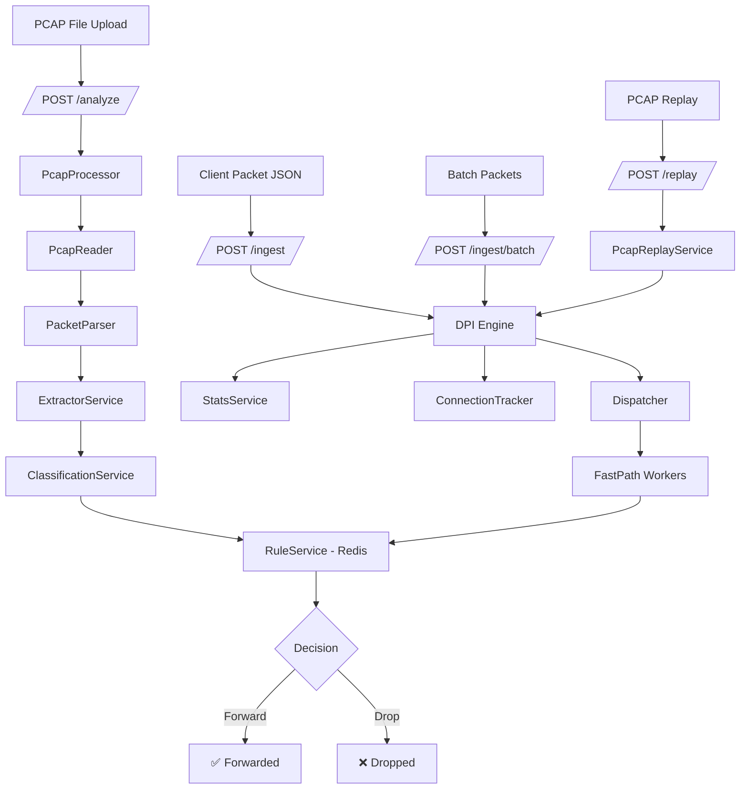

# 🔍 DPI Backend Service — Deep Packet Inspection Engine

[](https://github.com/VinayParmar555/Deep-Packet-Inspection/actions)
[](https://codecov.io/gh/VinayParmar555/Deep-Packet-Inspection)

A high-performance **Deep Packet Inspection (DPI)** backend built with **FastAPI**, capable of analyzing network traffic from `.pcap` files or live API ingestion. It extracts TLS SNI, classifies applications (YouTube, Facebook, Netflix, etc.), and enforces blocking rules via Redis.

---

## ✨ Features

- 📂 **PCAP File Analysis** — Upload `.pcap` files and get a full DPI report
- 🔄 **PCAP Replay** — Replay `.pcap` files through the live DPI engine for real-time metrics
- 🧠 **TLS SNI Extraction** — Identifies domains from encrypted HTTPS traffic
- 🌐 **HTTP Host / DNS Extraction** — Inspects plaintext HTTP and DNS queries
- 📱 **App Classification** — Detects 30+ app types via domain, IP, and port-based classification
- 🚫 **Rule-based Blocking** — Block by IP, domain, app, or port (Redis-backed)
- 📊 **Real-time Statistics** — Track packets, bytes, protocols, rates, and per-connection metrics
- 🧵 **Async Worker Architecture** — Dispatch + Fast Path workers for parallel processing
- 📦 **Batch Ingestion** — High-throughput batch packet processing endpoint
- 🧪 **Comprehensive Test Suite** — Unit tests with coverage reporting and CI/CD

---

## 🏗 Architecture


```mermaid
flowchart TD
    A[PCAP File Upload] --> B[/POST /analyze/]
    R[PCAP Replay] --> S[/POST /replay/]
    C[Client Packet JSON] --> D[/POST /ingest/]
    CB[Batch Packets] --> DB[/POST /ingest/batch/]
    B --> E[PcapProcessor]
    S --> RS[PcapReplayService]
    D --> F[DPI Engine]
    DB --> F
    RS --> F
    E --> G[PcapReader]
    G --> H[PacketParser]
    H --> I[ExtractorService]
    I --> J[ClassificationService]
    J --> K[RuleService - Redis]
    F --> SS[StatsService]
    F --> CT[ConnectionTracker]
    F --> L[Dispatcher]
    L --> M[FastPath Workers]
    M --> K
    K --> N{Decision}
    N -->|Forward| O[✅ Forwarded]
    N -->|Drop| P[❌ Dropped]
```

---

## 📂 Project Structure

```
├── main.py                          # App entry point — registers routers
├── requirements.txt                 # Python dependencies
├── Dockerfile                       # Docker image definition
├── docker-compose.yaml              # Redis + App orchestration
├── .env.example                     # Environment variable template
├── pytest.ini                       # Pytest configuration
├── test_metrics.py                  # Performance benchmark script
│
├── .github/
│   └── workflows/
│       └── test.yml                 # CI/CD: pytest + Codecov + Render deploy
│
├── app/
│   ├── routes/                      # API endpoints (separated by feature)
│   │   ├── pcap_routes.py           #   POST /analyze, POST /replay
│   │   ├── ingest_routes.py         #   POST /ingest, POST /ingest/batch
│   │   ├── stats_routes.py          #   GET /stats, /health, /rates, /workers
│   │   └── rules_routes.py          #   CRUD for /rules/ip, /domain, /app
│   │
│   ├── services/                    # Core business logic
│   │   ├── pcap_processor.py        #   Full PCAP → DPI pipeline
│   │   ├── pcap_replay_service.py   #   Replays PCAP through live DPI engine
│   │   ├── pcap_reader_service.py   #   Reads raw packets from .pcap files
│   │   ├── packet_parser_service.py #   Parses Ethernet/IP/TCP/UDP headers
│   │   ├── extractors_service.py    #   TLS SNI, HTTP Host, DNS extraction
│   │   ├── classification_service.py#   Maps domain/IP/port → AppType
│   │   ├── rule_service.py          #   Blocking rules engine (Redis)
│   │   ├── dpi_engine.py            #   Main orchestrator for API ingestion
│   │   ├── dispatcher_service.py    #   Load balances to FastPath workers
│   │   ├── fast_path.py             #   Worker that processes packets
│   │   ├── connection.py            #   Connection/flow tracker
│   │   └── stats_service.py         #   Centralized stats with rate metrics
│   │
│   ├── schema/                      # Pydantic data models
│   │   ├── pcap_report_schema.py    #   PCAP analysis report response
│   │   ├── pcap_schema.py           #   Raw PCAP file structures
│   │   ├── packet_schema.py         #   Packet input model
│   │   ├── parsed_packet_schema.py  #   Parsed packet fields
│   │   ├── connection_schema.py     #   FiveTuple, AppType, ConnectionState
│   │   ├── dpi_config_schema.py     #   Engine configuration (workers, queue)
│   │   ├── common_schema.py         #   IngestResponse model
│   │   ├── rule_schema.py           #   Block reason models
│   │   └── stats_schema.py          #   Stats & rate metrics response models
│   │
│   ├── cache/
│   │   └── redis.py                 # Async Redis client (connection pool)
│   │
│   ├── utils/
│   │   ├── pcap_generator.py        # Generates synthetic PCAP test files
│   │   └── thread_safe_queue.py     # Async bounded queue with back-pressure
│   │
│   └── tests/                       # Comprehensive test suite
│       ├── conftest.py              #   Pytest fixtures (Redis mocking)
│       ├── test_classification_service.py
│       ├── test_pcap_processor.py
│       ├── test_dpi_engine.py
│       ├── test_fast_path.py
│       ├── test_dispatcher_service.py
│       ├── test_rule_service.py
│       ├── test_extractor_service.py
│       ├── test_packet_parser_service.py
│       ├── test_stats_service.py
│       └── test_async_queue.py
```

---

## 🚀 Getting Started

### Prerequisites

- **Python 3.10+**
- **Redis** (for blocking rules)
- **Docker** (optional, for containerized setup)

### 1. Clone the Repository

```bash
git clone https://github.com/VinayParmar555/Deep-Packet-Inspection.git
cd Deep-Packet-Inspection
```

### 2. Create Virtual Environment

```bash
python -m venv venv

# Windows
venv\Scripts\activate

# Linux / macOS
source venv/bin/activate
```

### 3. Install Dependencies

```bash
pip install -r requirements.txt
```

### 4. Configure Environment Variables

```bash
cp .env.example .env
```

Edit `.env` with your Redis configuration:

| Variable | Description | Default |
|----------|-------------|---------|
| `REDIS_HOST` | Redis server hostname | *(required)* |
| `REDIS_PORT` | Redis server port | `6379` |
| `REDIS_DB` | Redis database number | `0` |

**Local example:**
```env
REDIS_HOST=localhost
REDIS_PORT=6379
REDIS_DB=0
```

> ⚠️ The server will **crash on startup** if `REDIS_HOST` is not set.

### 5. Start Redis

```bash
# If Redis is installed locally
redis-server

# Or using Docker (starts Redis only)
docker compose up -d redis
```

### 6. Run the Server

**Local:**
```bash
uvicorn main:app --reload
```
The server starts at **http://127.0.0.1:8000**

**Docker (full stack — Redis + App):**
```bash
docker compose up -d
```
The server is available at **http://127.0.0.1:8001** (Docker maps port 8001 → 8000)

### 7. Open API Docs

Navigate to **http://127.0.0.1:8000/docs** (local) or **http://127.0.0.1:8001/docs** (Docker) — interactive Swagger UI with all endpoints.

---

## 📡 API Endpoints

### 📂 PCAP Analysis

| Method | Endpoint | Description |
|--------|----------|-------------|
| `POST` | `/analyze` | Upload a `.pcap` file → get a full DPI report |
| `POST` | `/replay` | Replay a `.pcap` file through the live DPI engine for real-time metrics |

**Example** — Upload and analyze a PCAP file:
```bash
curl -X POST http://127.0.0.1:8000/analyze \
  -F "file=@your_capture.pcap"
```

**Response:**
```json
{
  "total_packets": 42,
  "forwarded_packets": 38,
  "dropped_packets": 4,
  "total_bytes": 52480,
  "tcp_packets": 35,
  "udp_packets": 7,
  "other_packets": 0,
  "app_breakdown": {
    "YOUTUBE": 12,
    "GOOGLE": 8,
    "UNKNOWN": 22
  },
  "domains_detected": [
    "www.google.com",
    "www.youtube.com"
  ],
  "connections": [
    {
      "src_ip": "192.168.1.100",
      "dst_ip": "142.250.185.206",
      "src_port": 52345,
      "dst_port": 443,
      "protocol": "TCP",
      "domain": "www.youtube.com",
      "app_type": "YOUTUBE",
      "packets": 12,
      "bytes": 14400,
      "blocked": false
    }
  ],
  "blocked_connections": []
}
```

**Example** — Replay a PCAP file for rate metrics:
```bash
curl -X POST "http://127.0.0.1:8000/replay?max_packets=50000&realtime=false" \
  -F "file=@your_capture.pcap"
```

| Parameter | Type | Default | Description |
|-----------|------|---------|-------------|
| `max_packets` | int | 10000 | Maximum packets to process (1–100000) |
| `realtime` | bool | false | Replay with original timing delays |
| `speed` | float | 1.0 | Speed multiplier for realtime replay (0.1–100.0) |

---

### 📥 Packet Ingestion (Live API)

| Method | Endpoint | Description |
|--------|----------|-------------|
| `POST` | `/ingest` | Send a single packet for real-time DPI processing |
| `POST` | `/ingest/batch` | Send multiple packets in a single request for high-throughput processing |

**Example — Single packet:**
```bash
curl -X POST http://127.0.0.1:8000/ingest \
  -H "Content-Type: application/json" \
  -d '{
    "tuple": {
      "src_ip": "192.168.1.100",
      "dst_ip": "142.250.185.206",
      "src_port": 52345,
      "dst_port": 443,
      "protocol": "TCP"
    },
    "size": 1200,
    "outbound": true,
    "tcp_flags": 2,
    "payload_length": 0,
    "domain": "www.youtube.com",
    "app_type": "YOUTUBE"
  }'
```

**Example — Batch ingestion:**
```bash
curl -X POST http://127.0.0.1:8000/ingest/batch \
  -H "Content-Type: application/json" \
  -d '[
    { "tuple": { "src_ip": "10.0.0.1", "dst_ip": "8.8.8.8", "src_port": 50000, "dst_port": 53, "protocol": "UDP" }, "size": 64 },
    { "tuple": { "src_ip": "10.0.0.1", "dst_ip": "142.250.1.100", "src_port": 52345, "dst_port": 443, "protocol": "TCP" }, "size": 1200 }
  ]'
```

---

### 🚫 Rule Management

| Method | Endpoint | Description |
|--------|----------|-------------|
| `POST` | `/rules/ip/{ip}` | Block an IP address |
| `DELETE` | `/rules/ip/{ip}` | Unblock an IP address |
| `GET` | `/rules/ip` | List all blocked IPs |
| `POST` | `/rules/domain/{domain}` | Block a domain |
| `DELETE` | `/rules/domain/{domain}` | Unblock a domain |
| `GET` | `/rules/domain` | List all blocked domains |
| `POST` | `/rules/app/{app_name}` | Block an app (e.g., YOUTUBE) |
| `DELETE` | `/rules/app/{app_name}` | Unblock an app |
| `GET` | `/rules/app` | List all blocked apps |

> **Note:** Port-based blocking is supported internally by the `RuleService` but is not currently exposed via API routes.

**Example** — Block YouTube:
```bash
curl -X POST http://127.0.0.1:8000/rules/app/YOUTUBE
```

---

### 📊 Monitoring

| Method | Endpoint | Description |
|--------|----------|-------------|
| `GET` | `/health` | Health check |
| `GET` | `/stats` | Overall packet statistics |
| `GET` | `/stats/connections` | Active connection list |
| `GET` | `/stats/apps` | Per-app traffic breakdown & unique domains |
| `GET` | `/stats/workers` | Worker dispatch statistics & queue sizes |
| `GET` | `/stats/rates` | Real-time rate metrics (packets/sec, throughput Mbps) |
| `GET` | `/stats/connections/metrics` | Per-connection performance metrics (duration, pps, throughput) |

---

## 🧠 How DPI Works

### TLS SNI Extraction

Even HTTPS traffic exposes the domain name in the **TLS Client Hello** (before encryption starts):

```
TLS Client Hello:
├── Version: TLS 1.2
├── Random: [32 bytes]
├── Cipher Suites: [list]
└── Extensions:
    └── SNI Extension:
        └── Server Name: "www.youtube.com"  ← Extracted!
```

### Supported Extractors

| Protocol | Port | What's Extracted |
|----------|------|------------------|
| TLS/HTTPS | 443 | SNI (domain name) |
| HTTP | 80 | Host header |
| DNS | 53 | Query domain |

### App Classification

Classification uses a multi-strategy priority system:

1. **Flow cache** — Bidirectional session memory for repeat packets
2. **Domain exact match** — e.g., `youtube.com` → YOUTUBE
3. **Domain suffix match** — e.g., `mail.google.com` → GOOGLE
4. **Local infrastructure handling** — Smart routing for gateway/machine IPs
5. **IP address match** — Exact IP and prefix-based lookup
6. **Port-based fallback** — Well-known ports (443 → HTTPS, 53 → DNS, etc.)
7. **Private IP detection** — Internal network traffic classification

**Detected application types:** Google, YouTube, Facebook, Instagram, WhatsApp, Twitter/X, Netflix, Amazon, Microsoft, Apple, Telegram, TikTok, Spotify, Zoom, Discord, GitHub, Cloudflare, LinkedIn, Akamai, Fastly, Sentry, Supabase, and protocol-level types (HTTP, HTTPS, DNS, SSH, EMAIL, STUN/VoIP, etc.)

---

## 🔐 Flow-Based Blocking

Blocking is applied at the **connection level**, not per-packet:

```
SYN           → Allowed (new connection)
SYN-ACK       → Allowed
Client Hello  → SNI: "youtube.com" detected
Rule Check    → YouTube is BLOCKED
Flow Marked   → BLOCKED
All Future    → DROP ❌
```

---

## ⚙️ Configuration

The DPI engine is configured via `DPIConfig` (in `app/schema/dpi_config_schema.py`):

| Parameter | Type | Default | Description |
|-----------|------|---------|-------------|
| `num_workers` | int | 4 | Number of FastPath worker processors |
| `queue_size` | int | 10000 | Max queue size per worker (back-pressure) |
| `verbose` | bool | false | Enable verbose logging |

---

## 🧪 Testing

### Run Unit Tests

```bash
pytest --cov=app
```

### Run Performance Benchmark

The `test_metrics.py` script replays PCAP files through the live engine and reports throughput metrics:

```bash
# Ensure the server is running first
python test_metrics.py
```

### CI/CD Pipeline

The project uses **GitHub Actions** (`.github/workflows/test.yml`):

1. **Test** — Runs `pytest` with coverage on every push/PR to `main`/`master`
2. **Coverage** — Uploads results to Codecov
3. **Deploy** — Auto-deploys to Render on merge to `main`/`master`

---

## 🏆 Key Engineering Highlights

- **Dual input modes** — PCAP file analysis + live API ingestion + PCAP replay
- **Flow-aware DPI** — Connection tracking with 5-tuple hashing
- **TLS SNI extraction** — Inspect encrypted traffic without decryption
- **Multi-strategy classification** — Domain → IP → Port fallback with flow caching
- **Async worker pool** — Dispatcher + FastPath workers for parallelism
- **Redis rule engine** — Real-time, distributed rule management
- **Rate metrics** — Sliding-window packets/sec and throughput calculations
- **Per-connection metrics** — Duration, packet rate, and throughput per flow
- **Clean architecture** — Separated routes, services, schemas, cache, and utils layers
- **Production-ready** — Async locking, connection pooling, back-pressure, graceful shutdown
- **Comprehensive testing** — 11 test modules with fixtures and Redis mocking

---

## 📜 License

This project is for educational and research purposes.
